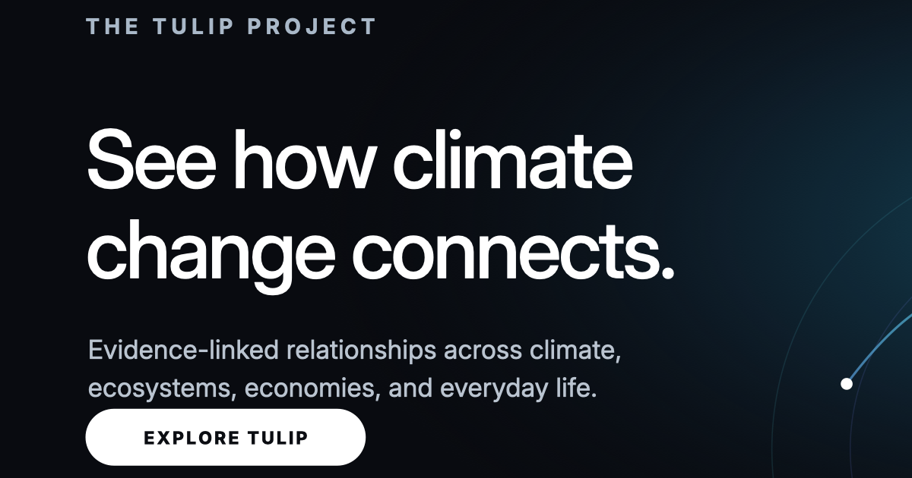

# THE TULIP PROJECT

TULIP is an interactive ecological causal network for exploring how climate,
ecosystems, infrastructure, economies, and everyday activities connect. The
public experience combines a navigable graph with source records, evidence
notes, relationship descriptions, urgency scoring, and personal-footprint
context.



## Status

TULIP is an independent, early-stage research and communication project. It is
currently designed for desktop browsers. Its scores and relationship views are
explanatory tools, not forecasts, professional advice, or substitutes for the
underlying scientific institutions and publications.

## Run locally

Requirements:

- Node.js 24 (the current development runtime)
- npm 11

Install and start the complete local environment:

```bash
npm ci
cp .env.local.example .env.local
npm run dev:full
```

The client is served at `http://127.0.0.1:3000` and the local data service at
`http://127.0.0.1:8787`. The API keys in `.env.local` are only needed when
refreshing their corresponding source snapshots; the checked-in public
experience uses frozen snapshots.

To run only the static client:

```bash
npm run dev
```

## Verify a change

```bash
npm run release:check
```

The production build is emitted to `dist/` and is intentionally ignored by
Git.

Production releases flow from a reviewed GitHub `main` commit through Vercel's
Git integration to <https://tulip-project-six.vercel.app/>. See the
[production release pipeline](docs/release-pipeline.md) for the permanent
release and verification contract.

## Production behavior

The public Vercel deployment is static-first:

- Versioned JSON snapshots are loaded directly from `public/`.
- Browser telemetry is disabled unless `VITE_TULIP_TELEMETRY_ENABLED=true` is
  deliberately supplied at build time.
- Browser-side third-party source refreshes are disabled unless
  `VITE_TULIP_REMOTE_REFRESH_ENABLED=true` is deliberately supplied.
- The public contact control exposes a mail link; it does not submit the hidden
  development contact form.
- Snapshot-write routes remain development-only and default to disabled.

Never expose private credentials through a `VITE_` variable. Vite embeds those
values in the browser bundle.

## Repository map

- `index.html` — document structure, dialogs, metadata, and accessibility entry
  points
- `src/` — graph rendering, interaction logic, evidence contracts, styles, and
  client data loaders
- `public/` — versioned snapshots, registries, images, and public metadata
- `scripts/` — source refreshers, exporters, audits, and regression checks
- `server/` — local research/development data service
- `docs/` — methodology reviews, rollout records, and scientific QA notes

## Evidence and third-party data

TULIP preserves source URLs, scope, uncertainty, and transformation notes in
its registries. Start with
[`public/tulip-source-registry.json`](public/tulip-source-registry.json) and the
in-app **Sources** and **Registries** views.

The Apache license applies to project code, not automatically to third-party
data, publications, names, or trademarks. See
[`DATA_AND_ATTRIBUTION.md`](DATA_AND_ATTRIBUTION.md) before redistributing
bundled materials.

## Security and privacy

- Do not commit `.env.local`, `.vercel/`, tokens, private keys, or generated
  build directories.
- Report suspected vulnerabilities through the private channel described in
  [`SECURITY.md`](SECURITY.md).
- The public application requires no account and telemetry is disabled by
  default.

## Contributing

Issues and focused pull requests are welcome. For changes to evidence or graph
relationships, include the source locator, claimed mechanism, geographic and
time scope, uncertainty, counterevidence, and the relevant generated-registry
updates. Run the full test and build commands before submitting.

## License

Project code is licensed under the
[Apache License 2.0](LICENSE). See [`NOTICE`](NOTICE) for project and
third-party attribution boundaries.
