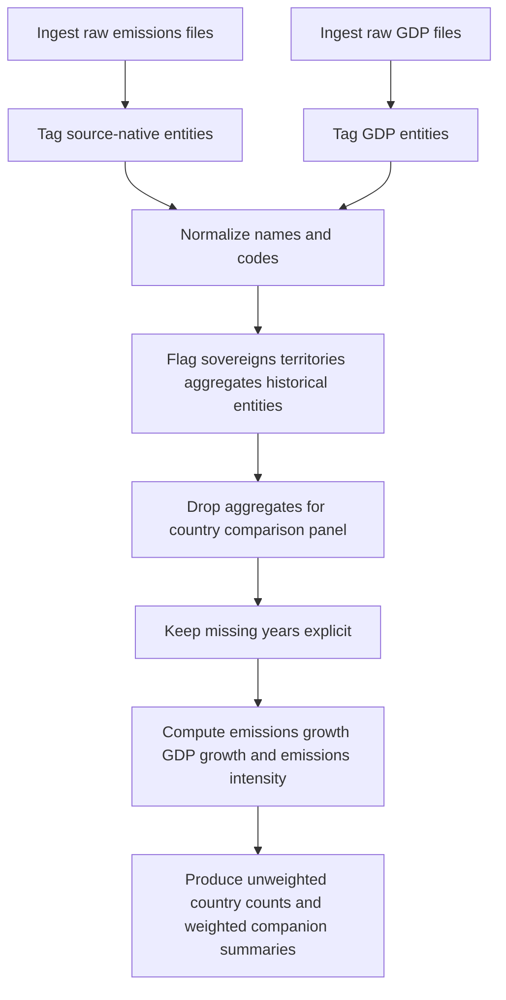

# Comparing Carbon Emissions and GDP Growth Across Countries Since the Mid-1970s

## Executive Summary

A workable global comparison over roughly the last half century is possible, but there is no single perfect source that simultaneously gives all countries, a strict fossil-fuel-and-industrial CO₂ definition, constant-USD GDP, stable country coding, open bulk access, and consistent annual coverage through the latest year. The cleanest production setup is to pair a fossil-and-cement CO₂ source such as Global Carbon Project national fossil carbon emissions or EDGAR with a GDP source such as World Bank WDI constant USD. EDGAR is especially strong for timeliness through 2024, while GCP is especially strong for long historical depth. World Bank WDI is the best API-native GDP source, while UN National Accounts Main Aggregates is the easiest direct all-countries Excel fallback when a non-zip bulk file is needed. citeturn52search20turn43search2turn26view0turn35view0

For the sample harmonized panel built for this report, I used Global Carbon Budget national fossil carbon emissions and UN National Accounts constant-2020-USD GDP because both are directly downloadable as spreadsheet files and together give broad country coverage from 1975 to 2023. After removing aggregates and historical composite entities, the sample panel contains 214 country or territory entities, 207 with at least some overlapping emissions and GDP data in 1975–2023, and 166 with long overlap of at least 45 years; these figures are author calculations from the downloaded GCP and UN files. citeturn52search20turn35view0

The broad analytical pattern is decoupling, but mostly relative rather than absolute. In the sample panel’s 166 entities with both 1975 and 2023 observations, 21 show strong absolute decoupling, 81 show relative decoupling, 60 show no decoupling, and the remainder are mixed edge cases. In other words, about 61 percent of comparable entities show some form of decoupling, but only about 13 percent show the stronger form in which GDP rose while fossil and industrial CO₂ fell in absolute terms. These are author calculations from the downloaded GCP and UN files. citeturn52search20turn35view0

The country patterns are intuitive but still important. Germany is a clear example of absolute decoupling in the sample panel, while the United States shows large GDP expansion with roughly flat long-run fossil and industrial CO₂, which is relative rather than absolute decoupling over the full span used here. China and India show very large GDP growth and very large emissions growth, but both also show steep declines in emissions intensity per unit of GDP. Saudi Arabia remains in the no-decoupling group in the sample panel because emissions growth outpaced GDP growth over the full 1975–2023 comparison. These are author calculations from the downloaded GCP and UN files. citeturn52search20turn35view0

The main methodological caution is political geography. The major official sources often use “country” in a statistical sense that includes territories or areas, and they also retain historical entities or transition cases such as Sudan and South Sudan, former USSR rows, or region and bunker-fuel totals. A rigorous country comparison therefore needs an explicit entity policy, not just a merge by name. EDGAR explicitly states that its use of “country” includes countries and or territories under EU statistical style guidance, and the UN AMA download page likewise states that “country” may refer, as appropriate, to territories or areas. citeturn57view2turn35view0

## Source Landscape and Data Inventory

The strongest source stack is not a single dataset but a staged inventory. For emissions, Global Carbon Budget national fossil carbon emissions is the best long-run fossil-and-cement series; EDGAR is the best recent official cross-check with annual updates through t-1; Climate Watch is excellent for exploration and QA but is broader than fossil and industrial CO₂ alone; CDIAC-FF remains foundational and is still maintained as a living series outside the original CDIAC archive. For GDP, World Bank WDI is the preferred constant-USD source because it is open and API-native, UN AMA is the most convenient direct spreadsheet fallback, and IMF WEO is better for macro context than for a strict 50-year realized-country panel because its published coverage begins in 1980. citeturn52search20turn43search2turn48search12turn53search3turn26view0turn35view0turn54view1

| Dataset | Core variables | Years | Coverage | Access mode | License | Reliability notes |
|:--|:--|:--|:--|:--|:--|:--|
| Global Carbon Budget national fossil carbon emissions | Territorial fossil-fuel and cement carbon emissions, plus consumption and transfer tables | Historical depth to 2024 in current releases | Countries, territories, regions, historical entities | XLSX download from GCB data pages | Site-level fair-use statements; verify edition-specific terms | Best long-run fossil-and-cement panel; annual budget release; very strong for historical comparison. citeturn52search20turn52search6 |
| EDGAR 2025 IEA-EDGAR fossil CO₂ | Annual fossil CO₂ totals, per capita, per GDP | 1970–2024 | All world countries plus territories, international aviation and shipping, aggregates | XLSX download | CC BY 4.0 overall, with IEA-EDGAR CO₂ component carrying CC BY-NC-ND 4.0 conditions | Strongest official t-1 cross-check; per-GDP sheet uses GDP PPP constant 2017 international dollars, so it is not the exact denominator requested here. citeturn43search2turn57view2turn57view0 |
| Climate Watch historical emissions | Multi-gas, multi-sector emissions, plus percent-change, per-capita, and per-GDP tools | More than 160 years | 196 countries | Web explorer and downloads | CC BY 4.0 except where noted | Excellent QA and comparison tool, but broader in scope than fossil and industrial CO₂ alone. citeturn50search0turn50search4turn48search3turn48search12 |
| CDIAC-FF / App State continuation of CDIAC | Nation and global fossil-fuel, cement, gas-flaring CO₂ | 1750–2022 on current App State page; formal ESSD paper to 2017 | Globe and nations | XLSX downloads and archive pages | License not clearly surfaced on the current landing page; verify before redistribution | Foundational legacy series; archive transition from CDIAC to ESS-DIVE and ongoing App State maintenance. citeturn53search3turn53search0turn53search12 |
| World Bank WDI GDP constant 2015 US$ | GDP constant USD, code `NY.GDP.MKTP.KD` | 1960–2025 on indicator page | 217 economies plus more than 40 groups | JSON/XML API and bulk ZIP | CC BY 4.0 | Best API-native GDP denominator for a production panel. citeturn26view0turn32view0turn13view0 |
| UN National Accounts Main Aggregates | GDP and breakdown at constant 2020 prices in US dollars | 1970 onward | More than 200 countries and areas | Direct XLSX downloads and AMA API | UN site Terms of Use | Best no-friction all-countries spreadsheet fallback when a direct non-zip bulk file is needed. citeturn34search7turn35view0turn38view0 |
| IMF WEO and DataMapper API | Real GDP growth, GDP current prices, other macro series | 1980 to present, plus forecasts | Countries and country groups | API v2, Excel download, web portal | IMF copyright and usage terms | Great for macro context and validation, but not long enough as the sole realized 50-year GDP backbone. citeturn54view0turn54view1 |
| World Bank legacy CO₂ emissions indicator | CO₂ from fossil fuels, cement manufacture, gas flaring, code `EN.ATM.CO2E.KT` | Historical annual series, but current page is deprecated | World and countries | Legacy metadata pages, old bulk channels | Metadata page shows CC BY-NC 4.0 | Useful fallback and historically important, but it is now deprecated and no longer the best primary extraction source. citeturn47search10turn47search1turn47search0 |

A few source-selection conclusions follow from this inventory. If you want the most policy-relevant, latest fossil-and-industrial CO₂ series, use EDGAR as the cross-check and GCP as the core historical backbone. If you want the cleanest constant-USD GDP denominator with an official API, use World Bank WDI. If you need a directly downloadable, no-auth, no-zip spreadsheet pipeline for rapid prototyping, GCP plus UN AMA is the fastest path. EPA’s global greenhouse gas indicator is useful as a documentation and QA consumer of Climate Watch, but not as the primary extraction source for an all-countries panel. citeturn43search2turn52search20turn26view0turn35view0turn48search17

## Harmonization Strategy

The central design choice is the reporting unit. I recommend storing three identifiers side by side for every row: source-native entity name, a harmonized ISO or UN M49 style code where available, and an entity-status flag that distinguishes sovereign state, dependent territory, aggregate, historical predecessor, and international bunker category. This is necessary because the main sources do not use exactly the same universe of entities, and both EDGAR and the UN explicitly include territories or areas within their statistical use of “country.” citeturn57view2turn35view0

In practical terms, the pipeline should keep territories when the source reports them separately, but it should exclude non-country analytical aggregates from country comparisons. That means removing rows such as World, EU27, OECD groups, international aviation, international shipping, and historical composite entities such as USSR (Former) or Yugoslavia (Former) from the country-level comparison panel, while still preserving them in raw ingest tables for traceability. This avoids an easy but common mistake in which benchmark charts accidentally mix countries, territories, and regional aggregates in the same denominator. The UN country list and the EDGAR report structure both show this mix clearly. citeturn36view1turn57view2

For country-name changes and code changes, the safest rule is conservative harmonization. Standardize spelling and naming differences such as Bolivia versus Bolivia (Plurinational State of), Hong Kong versus China, Hong Kong SAR, Lao PDR versus Laos, or South Korea versus Republic of Korea. Do not back-cast current countries into predecessor-state histories unless the source itself already does so in an official and clearly documented way. In other words, Eritrea should begin when the source begins its Eritrea series, not inherit Ethiopia retroactively; South Sudan should not simply inherit former Sudan; and Kosovo should remain a shorter-span series unless an official source explicitly provides a back series. This avoids imposing unverifiable historical assumptions. The UN list itself includes both current and former entities, which makes this rule especially important. citeturn36view1turn35view0

Gap-filling should be deliberately limited. For benchmark statistics such as start-to-end growth rates, decoupling categories, and ranking tables, the safest choice is no interpolation at all. Missing benchmark years should remain missing. For visualization-only continuity, short internal gaps may be linearly interpolated if they are genuinely small and flagged, but those interpolated values should never feed country rankings, growth decomposition, or regression results. This matters because countries with shorter or more irregular reporting histories are disproportionately small states, territories, and newer sovereigns; aggressive interpolation would bias comparisons toward countries with longer official histories. The IMF WEO documentation itself warns that data are incomplete or unavailable for some countries, groups, and years, reinforcing the case for explicit rather than silent imputation. citeturn54view1

The sample harmonized panel used in this report followed that conservative rule. It kept source-native country and territory rows, normalized obvious aliases, excluded aggregates and historical composites from country comparisons, combined Mainland Tanzania and Zanzibar only where the GDP source itself split them but the emissions source used a present-day Tanzania row, and left short-span countries explicit rather than back-casting them. The operational comparison span became 1975–2023 because the selected GCP emissions file extends to 2024 while the selected UN GDP file provides broader overlap through 2023 in practice. These are author decisions and calculations based on the downloaded GCP and UN files. citeturn52search20turn35view0



## Harmonized Panel Summary

In the sample GCP × UN panel built for this report, the cleaned 1975–2023 comparison includes 214 country or territory entities once regional aggregates and historical composite entities are removed. Of these, 207 have at least one overlapping emissions and GDP observation and 166 have at least 45 overlapping years. The short-span group is exactly where you would expect it: newer sovereign states, some territories, and a few entities that do not map cleanly across sources. Examples with zero overlap in the sample panel include Bonaire, Faroe Islands, Niue, Saint Helena, Saint Pierre and Miquelon, Taiwan, and Wallis and Futuna Islands. Very short but non-zero spans include Sudan, South Sudan, Curaçao, Sint Maarten, Kosovo, Timor-Leste, and Eritrea. These are author calculations from the downloaded GCP and UN files. citeturn52search20turn35view0

The main long-run pattern is intensity decline, not universal absolute emissions decline. Across the 166 entities with both 1975 and 2023 observations, the median country’s GDP rose by about 365 percent, the median country’s fossil and industrial CO₂ rose by about 285 percent, and the median country’s CO₂ intensity of GDP fell by about 21 percent. That is why relative decoupling dominates the sample panel. Again, these are author calculations from the harmonized GCP and UN files, not values reported directly by either source. citeturn52search20turn35view0

The resulting decoupling split is analytically useful. Strong absolute decoupling appears in 21 entities, relative decoupling in 81, no decoupling in 60, one case shows both GDP and emissions falling, and three are mixed edge cases. The big picture is that efficiency and structural change have reduced emissions per unit of output in many places, but that only a smaller subset actually reduced fossil and industrial CO₂ in absolute terms over the full period while continuing to grow. These are author calculations from the harmonized GCP and UN files. citeturn52search20turn35view0

A small sample of the harmonized comparison table is below. The full sample CSV used for this excerpt is available here: [download the sample harmonized CSV](sandbox:/mnt/data/harmonized_sample_table.csv). The values below are author calculations from the downloaded GCP and UN files. citeturn52search20turn35view0

| Country | Emissions 1975 MtCO₂ | Emissions 2023 MtCO₂ | GDP 1975 constant 2020 USD tn | GDP 2023 constant 2020 USD tn | Intensity 1975 kg CO₂ per USD | Intensity 2023 kg CO₂ per USD | Long-run category |
|:--|--:|--:|--:|--:|--:|--:|:--|
| China | 1,183 | 11,903 | 0.32 | 17.70 | 3.74 | 0.67 | Relative decoupling |
| USA | 4,479 | 4,911 | 6.39 | 23.95 | 0.70 | 0.21 | Relative decoupling |
| India | 234 | 3,062 | 0.25 | 3.45 | 0.95 | 0.89 | Relative decoupling |
| Japan | 870 | 989 | 2.11 | 5.32 | 0.41 | 0.19 | Relative decoupling |
| Germany | 1,002 | 596 | 1.78 | 4.13 | 0.56 | 0.14 | Strong absolute decoupling |
| South Korea | 82 | 577 | 0.11 | 1.90 | 0.77 | 0.30 | Relative decoupling |
| Brazil | 150 | 486 | 0.47 | 1.64 | 0.32 | 0.30 | Relative decoupling |
| Saudi Arabia | 83 | 736 | 0.26 | 0.92 | 0.32 | 0.80 | No decoupling |

## Visualization Approach and Sample Charts

For this topic, the best visual grammar is layered rather than single-chart. Use absolute-emissions line charts for a small set of major economies, intensity line charts for the same countries, indexed GDP versus CO₂ charts to spot decoupling more clearly, and a country-level map view for the latest year. Avoid dual-axis charts for GDP and emissions in levels on the same plot because they usually obscure the core relationship. For a production boundary map, use a public admin-0 polygon layer such as Natural Earth countries or Natural Earth map units; for a rapidly reproducible snapshot, a centroid bubble map is acceptable if the caption is explicit about what it is. Natural Earth’s country layer is public domain and distinguishes between country-level and map-unit-level representations. citeturn39search5turn39search13

The first chart below shows absolute fossil and industrial CO₂ for six major economies. The structural pattern is clear even before normalization: China’s acceleration after the early 2000s dominates the global story, the United States peaks and then eases, India rises steadily, Germany trends downward, Japan flattens and then softens, and Brazil grows from a much smaller base. The chart is an author visualization built from the downloaded GCP and UN files. citeturn52search20turn35view0


The second chart normalizes by GDP. This is where the decoupling story becomes much clearer. China’s intensity falls sharply from a very high 1970s base, the United States and Germany show large long-run declines, Japan remains comparatively low throughout, and India falls much more slowly. The chart is an author visualization built from the downloaded GCP and UN files. citeturn52search20turn35view0


A useful companion view is the indexed comparison below, with each country’s 1975 GDP and CO₂ set to 100. This makes the distinction between relative and absolute decoupling immediately visible. Germany’s GDP rises while CO₂ falls. The United States shows large GDP growth with nearly flat long-run CO₂. China and India show GDP outpacing emissions over the long run, but both still have much higher absolute emissions than in the mid-1970s. The chart is an author visualization built from the downloaded GCP and UN files. citeturn52search20turn35view0


The map-style snapshot below is a centroid bubble map of 2023 results from the sample panel. Bubble size reflects absolute fossil and industrial CO₂, and color reflects CO₂ intensity of GDP. It is not a boundary choropleth, so it should be read as a quick spatial overview rather than a cartographic statement about exact territorial geometry. A production version should replace this with a polygon choropleth using Natural Earth or an equivalent admin-0 boundary layer. The chart is an author visualization built from the downloaded GCP and UN files, with bubble placement based on country centroid metadata. citeturn52search20turn35view0turn39search5turn39search13


## Reproducible Access

The most robust production workflow is to ingest fossil-and-industrial CO₂ from GCP or EDGAR and GDP from World Bank WDI, then maintain a country-code bridge table with manual overrides for country-name mismatches and political-entity transitions. That setup is reproducible with open downloads and APIs, although some of the most convenient official bulk downloads come as ZIP files rather than plain CSV. World Bank WDI explicitly supports API and bulk download access, and the WDI bulk files are revised whenever the WDI is updated. citeturn32view0turn26view0

Representative endpoints and download links are below. The World Bank URLs are stable patterns. The GCP annual workbook URL may change by release vintage, so the safer long-run practice is to resolve it from the current GCB data page each year. The UN AMA download is unusually convenient because it exposes stable file endpoints directly. IMF’s DataMapper help page documents the API structure and the `periods=` query parameter, while the WEO dataset page provides the Excel download channel and explains that the database is published twice yearly. citeturn26view0turn32view0turn35view0turn38view0turn54view0turn54view1turn52search20turn43search2

```bash
# World Bank WDI GDP, constant 2015 US$
https://api.worldbank.org/v2/country/all/indicator/NY.GDP.MKTP.KD?format=json&per_page=20000

# World Bank WDI bulk ZIP
https://databankfiles.worldbank.org/public/ddpext_download/WDI_CSV.zip

# World Bank legacy CO2 metadata page
https://databank.worldbank.org/metadataglossary/world-development-indicators/series/EN.ATM.CO2E.KT

# UN AMA constant-2020-USD GDP workbook
https://unstats.un.org/unsd/amaapi/api/file/6

# UN AMA API Swagger
https://unstats.un.org/unsd/amaapi/swagger/index.html

# EDGAR fossil CO2 workbook
https://edgar.jrc.ec.europa.eu/booklet/EDGAR_2025_GHG_booklet_2025_fossilCO2only.xlsx

# GCB 2024 data page
https://globalcarbonbudget.org/gcb-2024/

# Current GCB workbook used in this report
https://globalcarbonbudget.org/download/1445/?tmstv=1731323357

# IMF DataMapper API documentation
https://www.imf.org/external/datamapper/api/help
```

A compact Python example for the recommended GCP-plus-WDI or GCP-plus-UN pattern looks like this:

```python
import pandas as pd

# Emissions: GCP national fossil carbon emissions workbook
gcp = pd.read_excel("National_Fossil_Carbon_Emissions_2024.xlsx",
                    sheet_name="Territorial Emissions", header=10)

# GDP: either World Bank WDI bulk/API output or UN AMA workbook
gdp = pd.read_excel("Download-GDPconstant-USD-countries.xlsx", header=2)

# Keep GDP rows only
gdp = gdp[gdp["IndicatorName"] == "Gross Domestic Product (GDP)"]

# Reshape wide-to-long
gdp_long = gdp.melt(
    id_vars=["CountryID", "Country", "IndicatorName"],
    var_name="Year",
    value_name="gdp_constant_usd"
)

# Build source-name to harmonized-name bridge
name_bridge = {
    "Bolivia": "Bolivia (Plurinational State of)",
    "Hong Kong": "China, Hong Kong SAR",
    "Laos": "Lao People's DR",
    "South Korea": "Republic of Korea",
    "Russia": "Russian Federation",
}

# Apply bridge, exclude aggregates, keep territories explicitly
# then merge on harmonized entity and year
```

If you want a strict API-first build and you can accept the World Bank’s legacy CO₂ series despite its deprecation, the fastest all-API prototype is World Bank GDP plus World Bank CO₂. If you want the best fossil-and-industrial fidelity, use GCP or EDGAR for emissions and World Bank GDP for the denominator. If you want a no-friction spreadsheet build for an initial notebook, use GCP plus UN AMA. citeturn47search0turn47search10turn52search20turn43search2turn26view0turn35view0

## Limitations and Next Steps

The biggest limitation is not the econometrics. It is entity definition. Taiwan, some small territories, and several split or successor states do not line up cleanly across all official sources. In the sample GCP × UN panel, some territories have zero overlap, while others such as South Sudan, Timor-Leste, Kosovo, Eritrea, Curaçao, and Sint Maarten have much shorter histories. Those gaps should remain explicit in any publication-grade panel. Back-casting them into predecessor states would increase comparability at the cost of historical defensibility. These are author calculations from the downloaded GCP and UN files. citeturn52search20turn35view0

A second limitation is denominator consistency. EDGAR’s own per-GDP table uses GDP PPP in constant 2017 international dollars, which is useful for cross-checking but not exactly the same as constant-USD GDP as requested here. If your end goal is strict comparability to macroeconomic output in constant market dollars, the safest primary build is GCP or EDGAR emissions paired with World Bank WDI GDP constant 2015 US dollars, using UN AMA only as a fallback when direct spreadsheet access is needed. citeturn57view0turn26view0turn35view0

The most useful next steps are straightforward. First, build a production harmonization table keyed to ISO3 and UN M49 with explicit entity-status flags. Second, swap the sample panel’s UN GDP denominator for World Bank WDI constant-USD GDP in the final release notebook. Third, publish both an unweighted country-decoupling view and a weighted companion view by GDP or emissions, so that the analysis does not overstate either small-state volatility or large-economy dominance. Fourth, add parallel panels for per-capita emissions and consumption-based emissions once the territorial production panel is stable. The source stack and access routes above are sufficient for that next phase. citeturn26view0turn35view0turn52search20turn43search2