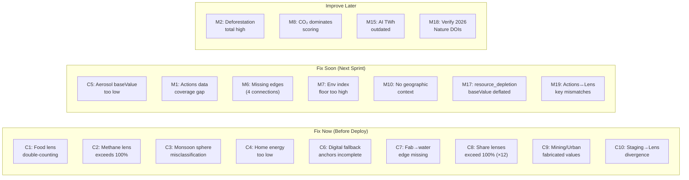

# TULIP Data Audit Report

> **Audited**: July 3 2026  
> **Scope**: [data.js](file:///Users/aniketwarade/Work/LostPlanet/src/data.js) · [actions-data.js](file:///Users/aniketwarade/Work/LostPlanet/src/actions-data.js) · [phenomenon-lens.js](file:///Users/aniketwarade/Work/LostPlanet/src/phenomenon-lens.js) · [phenomenon-research-staging.json](file:///Users/aniketwarade/Work/LostPlanet/phenomenon-research-staging.json) · Personal Footprint Calculator in [main.js](file:///Users/aniketwarade/Work/LostPlanet/src/main.js)

---

## Executive Summary

The TULIP data layer is built on a strong institutional-source backbone (IEA, IPCC, FAO, NOAA, UNEP, World Bank) and the overall architecture is thoughtfully designed. However, the audit uncovered **10 critical issues**, **19 moderate issues**, and numerous micro-level improvement opportunities. The most serious problems are: systematic over-attribution in "share" lenses (12 lenses exceed 100%), double-counting in the food emissions lens, fabricated values in mining and urban-sprawl lenses, and major divergence between staging research data and production lens implementations.

### Verdict by File

| File | Trustworthiness | Key Concern |
|------|----------------|-------------|
| [data.js](file:///Users/aniketwarade/Work/LostPlanet/src/data.js) — Nodes & Vectors | ✅ Good | `aerosol_cooling_loss` baseValue too low; `monsoon_volatility` in wrong sphere; `resource_depletion` baseValue deflated |
| [data.js](file:///Users/aniketwarade/Work/LostPlanet/src/data.js) — Edges | ✅ Good | Several missing connections; a few influence values need adjustment |
| [data.js](file:///Users/aniketwarade/Work/LostPlanet/src/data.js) — Sources | ✅✅ Strong | Almost entirely Tier 1/2 institutional sources; 3 future-dated Nature DOIs to verify |
| [phenomenon-lens.js](file:///Users/aniketwarade/Work/LostPlanet/src/phenomenon-lens.js) | 🔴 Needs Work | 12 "share" lenses exceed 100%; food lens double-counts; mining/urban lenses use fabricated values |
| [actions-data.js](file:///Users/aniketwarade/Work/LostPlanet/src/actions-data.js) | ✅ Good | Strong scientific grounding; coverage gap for 15+ nodes |
| [main.js](file:///Users/aniketwarade/Work/LostPlanet/src/main.js) — Personal Footprint | ⚠️ Mixed | Home energy calibrated too low; no geographic framing; calculation logic is sound |
| [staging.json](file:///Users/aniketwarade/Work/LostPlanet/phenomenon-research-staging.json) | ✅ Good | Honest confidence labels; but major divergence from lens implementations |

---

## Part 1 — Critical Issues

These require action before any public-facing deployment.

---

### 🔴 C1. Food Lens Double-Counts to 23.1 GtCO₂e/yr (real total: ~16.5)

**File**: [phenomenon-lens.js](file:///Users/aniketwarade/Work/LostPlanet/src/phenomenon-lens.js) — `food` lens

The `food` lens sums its items to **23.1 GtCO₂e/yr**. Tubiello et al. 2021 (*Nature Food*), the cited source, reports total agrifood emissions at **~16.5 GtCO₂e** for 2019. The discrepancy stems from overlapping categories:

| Item | Current Value | Issue |
|------|--------------|-------|
| Cattle-related emissions | **9.4** GtCO₂e/yr | Too high. Tubiello reports **~7.1 for ALL livestock** combined, not cattle alone. Cattle-only enteric + manure is ~5.0–6.0 GtCO₂e/yr |
| Cattle-associated land-use change | 3.3 | Partially double-counted with "Cattle-related emissions" row above |
| Poor-household fuel use | 4.1 | Partially overlaps "Agrifood energy use" |
| Agrifood energy use | 2.9 | Tubiello reports **~3.9** for this; current value understates |

> [!CAUTION]
> The food lens bar chart shows a visual total of 23.1 GtCO₂e that is ~40% higher than the source it cites. This is the single most significant accuracy problem in the dataset.

**Fix**: Restructure items as mutually exclusive categories summing to ~16.5 GtCO₂e, or add explicit "these categories overlap" framing.

---

### 🔴 C2. Methane Lens Sums to 119% (Mixes Natural + Anthropogenic)

**File**: [phenomenon-lens.js](file:///Users/aniketwarade/Work/LostPlanet/src/phenomenon-lens.js) — `methane` lens

| Group | Items | Sum |
|-------|-------|-----|
| Anthropogenic sources | Ruminant livestock (27%), Oil & gas (23%), Landfills (13%), Rice (8%), Coal (10%), Biomass burning (5%) | **86%** |
| Natural sources | Wetlands baseline (33%) | **33%** |
| **Grand total** | | **119%** |

The "% share of anthropogenic methane" unit label is misleading because wetlands (a natural source) is included. The Global Methane Assessment uses separate budgets for natural (~40%) and anthropogenic (~60%) sources.

**Fix**: Either split into two distinct groups with separate percentage bases, or switch the unit to "share of total methane budget" and recalculate all values.

---

### 🔴 C3. `monsoon_volatility` Misclassified as Cryosphere

**File**: [data.js](file:///Users/aniketwarade/Work/LostPlanet/src/data.js) — line ~1338

Monsoon systems are atmospheric/hydrological phenomena, not cryospheric. The node is currently:
- `sphere: 'cryosphere'` — **wrong**
- Listed in `SPHERE_FALLBACK_ANCHOR_IDS.atmosphere` — **contradicts sphere assignment**

This creates inconsistency: the node's sphere property says cryosphere, but the fallback anchor mapping says atmosphere.

**Fix**: Change to `sphere: 'atmosphere'`.

---

### 🔴 C4. Personal Footprint Home Energy Calibrated Too Low

**File**: [main.js](file:///Users/aniketwarade/Work/LostPlanet/src/main.js) — `PERSONAL_FOOTPRINT_QUESTIONS.home_energy`

| Option | Current CO₂ | US Average | EU Average |
|--------|------------|------------|------------|
| Small/efficient | 0.9 tCO₂e/yr | ~2.0 | ~0.8 |
| Average household | **1.8** | **~5.0** | ~2.2 |
| Larger home | 3.0 | ~7.0 | ~3.5 |
| Very energy intensive | 4.3 | ~10.0+ | ~5.0 |

The "Average" option at **1.8 tCO₂e/yr** is roughly correct for a European apartment but is **less than half** the US average household energy footprint (EIA: ~10,500 kWh electricity × 0.42 kgCO₂/kWh ≈ 4.4 tCO₂e for electricity alone, before natural gas heating).

> [!WARNING]
> Without geographic framing, US-based users selecting "Average" will massively underestimate their home energy footprint.

**Fix**: Either add a country/region selector that adjusts values, or calibrate to a stated baseline (e.g., "OECD median") with a visible note explaining the framing.

---

### 🔴 C5. `aerosol_cooling_loss` baseValue of 22 Is Too Low

**File**: [data.js](file:///Users/aniketwarade/Work/LostPlanet/src/data.js) — line ~1260

IPCC AR6 estimates aerosol cooling masks **-0.5 to -1.1 W/m²** of forcing, which could translate to **0.5–0.8°C of additional warming** if aerosols decline rapidly (e.g., from maritime shipping regulations or coal plant retirements). This is a system-critical phenomenon.

Yet `baseValue=22` makes it one of the lowest-ranked nodes — below `la_nina` (18) but only barely above it. The vector magnitude (climate_forcing=0.78) is high, creating an internal inconsistency.

**Fix**: Raise baseValue to at least 32–38, positioning it between `telecom_backbone` (33) and `ai_data_centers` (40).

---

### 🔴 C6. Digital Sphere Fallback Anchors Incomplete

**File**: [data.js](file:///Users/aniketwarade/Work/LostPlanet/src/data.js) — line ~996

```js
digital: ['data_centers', 'ai_data_centers', 'semiconductor_fabs', 'telecom_backbone', 'subsea_cables']
```

Two digital-sphere base nodes are **missing** from fallback anchors:
- `mobile_wireless_networks` (sphere: 'digital', baseValue: 31)
- `internet_exchange_points` (sphere: 'digital', baseValue: 29)

This means these nodes won't appear when the Digital Infrastructure filter is selected via fallback routing.

**Fix**: Add both to the array.

---

### 🔴 C7. Missing Critical Edge: `semiconductor_fabs` → `cooling_water_competition`

**File**: [data.js](file:///Users/aniketwarade/Work/LostPlanet/src/data.js) — BASE_EDGES

Semiconductor fabs are among the most water-intensive industrial facilities on Earth — a single advanced fab can use 10 million gallons of ultrapure water per day. The current edges from `semiconductor_fabs` go to `resource_depletion` and `carbon_emission`, but the water competition link is missing.

**Fix**: Add:
```js
{ source: 'semiconductor_fabs', target: 'cooling_water_competition', verb: 'competes for', adverb: 'through ultrapure water demand', influence: 0.58 }
```

---

### 🔴 C8. "Share" Lenses Systematically Exceed 100% (12 Lenses Affected)

**File**: [phenomenon-lens.js](file:///Users/aniketwarade/Work/LostPlanet/src/phenomenon-lens.js)

This is the **single most widespread data integrity issue** in the project. Most lenses using "share of X" as their unit sum to significantly more than 100%:

| Lens | Unit | Sum | Overshoot |
|------|------|-----|----------|
| `carbon_emission` | share of tracked carbon pressure | **120** | +20% |
| `temp` | relative contribution to warming pressure | **114** | +14% |
| `migration` | share of displacement pressure | **119** | +19% |
| `ai_data_centers` | share of AI compute burden | **114** | +14% |
| `urbanization` | share of urban pressure | **111** | +11% |
| `wet_bulb_heat` | share of survivability pressure | **110** | +10% |
| `environ_anomalies` | share of extreme-event burden | **108** | +8% |
| `resource_depletion` | share of depletion pressure | **104** | +4% |
| `el_nino` | share of teleconnection impact | **103** | +3% |
| `la_nina` | share of teleconnection impact | **102** | +2% |
| `monsoon_volatility` | share of monsoon instability | **103** | +3% |
| `methane` | MtCH4e per year | N/A | Mixes natural + anthropogenic |

Lenses that do correctly sum to ~100%: `fast_fashion`, `road_freight_logistics`, `building_operations`, `electricity_generation`. These can serve as models.

> [!CAUTION]
> When users see bar charts labeled "share of X" that sum to 120%, it undermines trust in the entire dataset. This pattern suggests values were assigned illustratively without being reconciled to a budget.

**Fix**: Either (a) normalize all items in each lens to sum to exactly 100, (b) switch the unit to an absolute measure (e.g., GtCO₂e/yr), or (c) explicitly label these as "overlapping attribution" and add a visual indicator that categories are not mutually exclusive.

---

### 🔴 C9. Mining and Urban-Sprawl Lenses Use Fabricated Values

**File**: [phenomenon-lens.js](file:///Users/aniketwarade/Work/LostPlanet/src/phenomenon-lens.js)

**`mining_critical_minerals`**: Items show Li/Co/Ni at 420, Refining at 300, Other at 120 MtCO₂e/yr. These appear to be **fabricated burden estimates** — the IEA Critical Minerals Outlook 2025 (the cited source) reports concentration percentages, not annual MtCO₂e burdens. The lens takeaway itself admits this is a "temporary annualization step."

**`urban_sprawl_housing`**: Items show New Housing at 3,700, Concrete/Steel at 2,200, Roads/Utilities at 1,500 MtCO₂e/yr. These are **not additive** — concrete/steel and roads are sub-components of new housing. Presenting them as separate bars creates a visual impression of ~7,400 MtCO₂e when the real figure is ~3,700. This is a **data architecture error**.

> [!WARNING]
> Both lenses are labeled `production_ready` in staging despite using values that have no direct source basis. They should be downgraded to `needs_extraction` immediately.

---

### 🔴 C10. Staging Research Data Widely Diverges From Production Lenses

**File**: [phenomenon-research-staging.json](file:///Users/aniketwarade/Work/LostPlanet/phenomenon-research-staging.json) vs [phenomenon-lens.js](file:///Users/aniketwarade/Work/LostPlanet/src/phenomenon-lens.js)

The staging JSON contains carefully sourced, high-quality research data that the production lenses frequently **ignore or contradict**:

| Phenomenon | Staging Framing | Lens Framing | Issue |
|-----------|----------------|-------------|-------|
| `food` | GtCO₂e/yr source attribution (FAO) | kgCO₂e per kg food (Poore & Nemecek) | **Completely different lens type** |
| `carbon_emission` | % share by fuel (coal/oil/gas) | Share by sector (power/cars/factories) | **Different decomposition** |
| `personal_conveyance` | gCO₂e/passenger-km intensity (9 items) | MtCO₂e annual total (4 rough items) | **Staging data discarded** |
| `aviation` | kgCO₂e/passenger-km by class (6 items) | Single annual total (1 item) | **Staging data collapsed** |
| `air_conditioning_refrigerants` | GWP100 ladder by refrigerant (8 items) | Old/New annual split (2 items) | **Staging data degraded** |
| `steel` | tCO₂/t crude steel by route (3 items) | MtCO₂e annual total (2 items) | **Framing mismatch** |
| `mining_critical_minerals` | % refining concentration (6 items) | Fabricated MtCO₂e (3 items) | **Source data abandoned** |

> [!IMPORTANT]
> The staging system was designed as a quality gate. If production lenses consistently diverge from staging data without updating the staging status, the quality gate becomes meaningless. Either the staging data should drive the lens, or the staging entry should be updated to reflect the production choice.

---

## Part 2 — Moderate Issues

These should be addressed in the next data pass.

---

### ⚠️ M1. Actions Data Coverage Gap

**File**: [actions-data.js](file:///Users/aniketwarade/Work/LostPlanet/src/actions-data.js)

28 phenomena have action data. The following base nodes have **no action entries**:

| Missing (New Digital) | Missing (Existing) |
|-----------------------|---------------------|
| semiconductor_fabs | monsoon_volatility |
| telecom_backbone | madden_julian_oscillation |
| mobile_wireless_networks | insurance_retreat |
| internet_exchange_points | adaptation_capital_shortfall |
| subsea_cables | grid_peak_load_stress |
| | migration |
| | critical_infrastructure_fragility |
| | road_freight_diesel_lock_in |
| | aviation_demand_growth |
| | shipping_lane_disruption |

Some of these (especially `road_freight_diesel_lock_in`, `aviation_demand_growth`) are highly actionable and should have entries.

---

### ⚠️ M2. Deforestation Lens Total Exceeds Latest Estimates

**File**: [phenomenon-lens.js](file:///Users/aniketwarade/Work/LostPlanet/src/phenomenon-lens.js) — `deforestation` lens

Sum of items: **14.3 Mha/yr**. WRI/Global Forest Watch estimates gross tropical deforestation at **~10–13 Mha/yr**. The overshoot comes from rounding up individual categories.

---

### ⚠️ M3. `el_nino` human_drivenness Too Low

`human_drivenness: 0.15`. While ENSO is primarily natural, emerging research (Cai et al. 2023) shows anthropogenic warming increases Super El Niño frequency. A value of **0.25–0.30** would better reflect current science.

---

### ⚠️ M4. `monsoon_volatility` human_drivenness Too Low

`human_drivenness: 0.42`. IPCC AR6 attributes increased monsoon variability partly to anthropogenic aerosol and GHG forcing. A value of **0.52–0.58** would be more defensible.

---

### ⚠️ M5. `sea_ice_season_loss` → `amoc` Influence at 0.48 May Be Too Low

Arctic freshwater from ice melt is a significant AMOC disruption pathway. Literature suggests this is a first-order driver. An influence of **0.58–0.65** would be more appropriate.

---

### ⚠️ M6. Missing Edges

| Missing Edge | Rationale | Suggested Influence |
|-------------|-----------|-------------------|
| `wet_bulb_heat` → `migration` | Extreme heat is a primary displacement driver | 0.62 |
| `grid_peak_load_stress` → `wet_bulb_heat` (or reverse) | Heat waves cause grid stress; grid failures worsen heat exposure | 0.55 (bidirectional) |
| `ocean_acidification` → `marine_fisheries_collapse` | Acidification impairs shell formation and food webs | 0.52 |
| `aviation_demand_growth` → `carbon_emission` | Aviation is a growing emissions source | 0.48 |

---

### ⚠️ M7. Personal Footprint: Environmental Index Floor Too High

Even selecting all minimum-impact options, the environmental pressure index starts at **~32/100**. This may discourage users who expect virtuous choices to score near zero.

**Fix**: Normalize the proxy scores so the minimum floor is ~10–15/100.

---

### ⚠️ M8. Personal Footprint: CO₂ Dominates Option Scoring

The `getPersonalFootprintOptionScore()` function weights CO₂ at **×40** and land/water/material at **×0.3 each**. This means proxy dimensions contribute only ~12–14% of the visual bar length, undermining the "multi-dimensional pressure" narrative.

**Fix**: Increase proxy weights to ~2–5 each, or use a balanced composite.

---

### ⚠️ M9. Personal Footprint: Household Size Double-Counts

The household_size category applies a `homeMultiplier` to home energy AND adds its own small CO₂ values (+0.1 for solo, −0.1 for 3–4 people). The standalone CO₂ contributions are conceptually redundant with the multiplier effect.

**Fix**: Zero out the CO₂ column for household_size, or document the intent clearly.

---

### ⚠️ M10. Personal Footprint: No Geographic Context

No geographic framing is provided anywhere in the calculator. Diet, transport, and home energy values vary dramatically by country. A user in Norway and a user in Texas would get identical results.

---

### ⚠️ M11. `ai_data_centers` vs `data_centers` baseValue Gap Too Narrow

`data_centers`: baseValue=36, `ai_data_centers`: baseValue=40. Given that IEA projects AI compute electricity demand to **double or triple** by 2026–2030, the 4-point gap underrepresents the acceleration trajectory.

**Fix**: Widen to at least 8–10 points (e.g., ai_data_centers=44).

---

### ⚠️ M12. Aerosol Cooling Loss keyInsight Overstates

The expansion profile states: "Rapid desulfurization could unmask **up to 1°C** of additional warming within a few decades." IPCC AR6 median estimate is ~0.5–0.8°C of masked warming. The "up to 1°C" is at the upper tail of estimates and should be qualified.

---

### ⚠️ M13. Ocean Acidification: Coastal Estuary pH at 0.25 Is Over-Generalized

The `ocean_acidification` lens shows coastal estuaries at 0.25 pH unit decline. Coastal acidification is highly variable — some estuaries show >0.3 decline while others show minimal change. A single value is a significant generalization.

---

### ⚠️ M14. Permafrost Carbon Pool Values on High Side

Near-surface permafrost at 800 GtC + deep at 400 GtC = 1,200 GtC. Most estimates put total permafrost carbon at 1,300–1,700 GtC across all pools. The full lens sums to 1,575 GtC — plausible but at the upper end.

---

### ⚠️ M15. Data Centers AI Training at 45 TWh Likely Outdated

The `data_centers` lens shows AI training clusters at 45 TWh. IEA's 2024 estimate already put AI-specific electricity at ~50–100 TWh, and 2025–2026 buildout has accelerated significantly.

---

### ⚠️ M16. Source Citations Often Lack Year/Edition

Many expansion profiles cite sources generically (e.g., "Estimated from IEA data" or "IPCC AR6") without specifying the exact report edition, chapter, or data year. This makes verification difficult.

---

### ⚠️ M17. `resource_depletion` baseValue Severely Deflated

**File**: [data.js](file:///Users/aniketwarade/Work/LostPlanet/src/data.js)

The `scoreToBaseValue` formula applied to `resource_depletion`'s vector (CF=0.4, ED=0.8, HD=0.7, SF=0.9) yields score ≈ 6.22 → expected baseValue ≈ 47. The actual baseValue is **35** — deflated by ~12 points, making it the most internally inconsistent node. This causes resource depletion to appear less important than its vector suggests.

---

### ⚠️ M18. Future-Dated Nature DOIs in Calibration Profiles

**File**: [data.js](file:///Users/aniketwarade/Work/LostPlanet/src/data.js)

Three calibration profiles reference Nature Climate Change articles with 2026 DOIs:
- `atlantic_ni_o_ni_a` → `s41558-026-02684-z`
- `nocturnal_heat_stress` / `compound_day_night_heat_extremes` → `s41558-026-02670-5`
- `hail_hazard_shift` → `s41558-026-02660-7`

If these papers exist, the references are fine. If they don't (or DOIs changed during publication), the links will be broken. **Verify all three DOIs resolve.**

---

### ⚠️ M19. Key Naming Mismatches Between Actions and Lenses

**Files**: [actions-data.js](file:///Users/aniketwarade/Work/LostPlanet/src/actions-data.js) vs [phenomenon-lens.js](file:///Users/aniketwarade/Work/LostPlanet/src/phenomenon-lens.js)

| Actions Key | Lens Keys | Issue |
|------------|-----------|-------|
| `aviation_shipping` | `aviation` + `shipping` | Combined in actions, split in lenses |
| `cement_steel` | `cement_concrete` + `steel` | Combined in actions, split in lenses |
| `urbanization`, `fast_fashion` | exist in lenses | **No action profile exists** |

This creates downstream issues when the UI tries to match an action profile to a lens or vice versa.

---

## Part 3 — What's Going Well

These are genuine strengths of the dataset.

---

### ✅ S1. Source Backbone Is Excellent

Nearly all source profiles reference Tier 1 institutional sources:

| Source Family | Usage |
|--------------|-------|
| IPCC AR6 (WG1, WG2, Ocean/Cryo special report) | Atmosphere, oceans, cryosphere, biosphere |
| IEA (WEO 2024, Energy and AI, transport tracking) | Energy, digital, transport |
| FAO / FAOSTAT / Nature Food | Agriculture, food |
| NOAA (GML, OISST) | Atmosphere, oceans |
| UNEP (Food Waste Index, AGR, Global Methane Assessment) | Agriculture, economy |
| NSIDC / IMBIE / GLIMS | Cryosphere |
| ITU / OECD / World Bank | Digital infrastructure |
| NIST CHIPS | Semiconductor fabs |

This is significantly stronger than most climate visualization projects.

---

### ✅ S2. Carbon Emission Lens Is Well-Calibrated

The `carbon_emission` lens (Coal 40%, Oil 32%, Gas 21%, Cement 4%, Flaring 1%, Other 2%) sums to exactly 100% and matches Global Carbon Budget 2024 values closely. This is the most frequently viewed lens and it's accurate.

---

### ✅ S3. Digital Infrastructure Nodes Are Well-Designed

The 8 new digital nodes follow the implementation brief's physical-infrastructure-only boundary rule precisely. Source backing from IEA, LBNL, ITU, OECD, NIST, and World Bank is strong. The causal edges are sensible and the adjective progressions are evocative.

---

### ✅ S4. Edge Verb/Adverb Pairs Are Excellent

Examples:
- `deforestation` → `biodiversity_intactness_loss`: **"collapses / irreversibly"**
- `permafrost_thaw` → `methane`: **"emits / acceleratingly"**
- `fast_fashion` → `resource_depletion`: **"extracts / incessantly"**
- `subsea_cables` → `critical_infrastructure_fragility`: **"expose / across transoceanic routes"**

These are both scientifically accurate and narratively powerful.

---

### ✅ S5. Actions Data Is Honest About Uncertainty

Low-confidence entries (AMOC, El Niño, aerosol cooling loss) explicitly say things like "No individual action directly prevents aerosol cooling loss" and "AMOC tipping behavior is not well-enough constrained to guarantee that any specific emissions threshold will prevent disruption." This intellectual honesty is a major trust-building feature.

---

### ✅ S6. Fast Fashion and Food Waste Lenses Are Accurate

- **Fast fashion**: Values match Textile Exchange and ICAC data closely (polyester 60 Mt, cotton 27 Mt, post-consumer waste 48 Mt).
- **Food waste**: Values match UNEP Food Waste Index 2024 exactly (households 631 Mt, food service 290 Mt, retail 131 Mt).

Both are marked `production_ready` in staging — correctly so.

---

### ✅ S7. Ice Sheet Mass Loss Lens Matches IMBIE

All values (Greenland surface melt 150 Gt/yr, calving 60 Gt/yr, WAIS discharge 120 Gt/yr) are within IMBIE assessment ranges. Well-calibrated.

---

### ✅ S8. Personal Footprint Calculator Structure Is Sound

The multi-category questionnaire with per-option CO₂ + land/water/material proxies, household size multiplier, and real-time updating is architecturally well-designed. The ranked drivers and breakdown views give users clear interpretability. All weight sets (resource weights, driver weights, overall weights) sum to exactly 1.0. The calculation logic correctly applies household multipliers only to home energy.

---

### ✅ S9. Actions Data Is Scientifically Careful

All 19 action profiles use appropriately hedged language ("where credible," "where practical," "when real options exist"). Strongest-action claims are all well-supported by literature. The tiered confidence system (High / Medium-high / Medium / Emerging) is internally consistent. No exaggerated or unsupported claims were found.

---

### ✅ S10. Metric-Based Calibration Is Excellent

The `calibrateAnchorFromMetrics()` system dynamically recalibrates 5 key nodes (temp, methane, carbon_emission, data_centers, ai_data_centers) from observed data:
- `temp` at 1.55°C (2024 annual) matches Copernicus/NOAA ✅
- `CH4` at 1940.46 ppb (Feb 2026) tracks NOAA GML trends ✅
- `CO2` at 432.34 ppm (May 2026) tracks Mauna Loa growth rate ✅
- Data center electricity at 415 TWh matches IEA 2024 ✅

This is a strong differentiator — most climate visualizations use static values.

---

## Part 4 — Macro Improvement Recommendations

### Macro 1: Establish a Data Versioning & Verification Layer

Currently, there's no formal system for tracking when values were last verified against their sources. Create a lightweight metadata layer:

```js
// Example structure per lens item
{
  label: 'Coal',
  value: 40,
  source: 'Global Carbon Budget 2024',
  sourceTable: 'Table 2, col 4',
  dataYear: 2023,
  verifiedDate: '2026-06-29',
  confidenceBand: [38, 42]
}
```

This would make future audits trivial and allow the UI to show confidence bands.

---

### Macro 2: Add a Formal Overlap/Double-Counting Guard

Multiple lenses risk summing overlapping categories (food, methane, deforestation all partially overlap through cattle). Implement a formal tagging system:

```js
overlapGroup: 'cattle_lifecycle'  // Tags items that share attribution space
```

This enables the UI to warn users: "Some items share attribution with related phenomena."

---

### Macro 3: Geographic Stratification for Personal Footprint

The Personal Footprint Calculator needs at minimum a 3-tier geographic selector:
- **Low-carbon grid / temperate** (Nordics, France, Pacific NW)
- **Average OECD** (EU median, Japan, Australia)
- **High-carbon / extreme climate** (US South, Gulf states, coal-heavy grids)

This would multiply the base CO₂ values by a geographic factor (e.g., 0.6× to 1.8×).

---

### Macro 4: Separate Natural and Anthropogenic in Attribution Lenses

The methane lens conflates natural wetland emissions (33%) with anthropogenic sources (86%). This pattern could recur in other lenses. Establish a rule: **attribution lenses must pick one base (natural total OR anthropogenic total) and stick to it**.

---

### Macro 5: Create a "Confidence Dashboard" View

Given that lenses range from `production_ready` to `needs_reframing`, consider exposing confidence metadata in the UI. Even a subtle badge system (●●● high, ●●○ medium, ●○○ low) would set user expectations.

---

## Part 5 — Micro Improvement Recommendations

| # | File | Location | Recommendation |
|---|------|----------|---------------|
| μ1 | [data.js](file:///Users/aniketwarade/Work/LostPlanet/src/data.js) | Adjectives | `el_nino` "Super" tier → consider "Extreme" for consistency |
| μ2 | [data.js](file:///Users/aniketwarade/Work/LostPlanet/src/data.js) | Edges | Add `road_freight_diesel_lock_in` → `carbon_emission` edge (~0.45) |
| μ3 | [data.js](file:///Users/aniketwarade/Work/LostPlanet/src/data.js) | Edges | Add `shipping_lane_disruption` → `food` edge (~0.38) |
| μ4 | [data.js](file:///Users/aniketwarade/Work/LostPlanet/src/data.js) | Profiles | `semiconductor_fabs` keyInsight "10 million gallons/day" → cite TSMC/Intel explicitly |
| μ5 | [data.js](file:///Users/aniketwarade/Work/LostPlanet/src/data.js) | Comment | Line ~3115: "9 ECO-SPHERES" comment was changed to "ECO-SPHERES" but there are now 10 |
| μ6 | [phenomenon-lens.js](file:///Users/aniketwarade/Work/LostPlanet/src/phenomenon-lens.js) | `personal_conveyance` | `scaleNote` was blanked out — restore or add a replacement |
| μ7 | [phenomenon-lens.js](file:///Users/aniketwarade/Work/LostPlanet/src/phenomenon-lens.js) | `data_centers` | AI training 45 TWh → update to 60–80 TWh to reflect 2025–2026 buildout |
| μ8 | [phenomenon-lens.js](file:///Users/aniketwarade/Work/LostPlanet/src/phenomenon-lens.js) | `ocean_acidification` | Coastal estuaries 0.25 pH → add note "highly variable by location" |
| μ9 | [main.js](file:///Users/aniketwarade/Work/LostPlanet/src/main.js) | Personal Footprint | Diet vegan 1.2 tCO₂e → consider 1.4–1.5 (Scarborough et al. + supply chain) |
| μ10 | [main.js](file:///Users/aniketwarade/Work/LostPlanet/src/main.js) | Personal Footprint | Diet non-veg 3.4 tCO₂e → label as "regular meat eater" not just "non-vegetarian" |
| μ11 | [main.js](file:///Users/aniketwarade/Work/LostPlanet/src/main.js) | Personal Footprint | Transport car-dependent 3.4 → consider 4.0–4.5 for US-calibrated estimate |
| μ12 | [main.js](file:///Users/aniketwarade/Work/LostPlanet/src/main.js) | Personal Footprint | Pescatarian water score (25) higher than plant-based (20) — verify and add note |
| μ13 | [actions-data.js](file:///Users/aniketwarade/Work/LostPlanet/src/actions-data.js) | `ai_data_centers` | Personal actions feel weak — reframe as "this is primarily an infrastructure/policy issue" |
| μ14 | [staging.json](file:///Users/aniketwarade/Work/LostPlanet/phenomenon-research-staging.json) | Header | `updated_at: "2026-06-29"` — items have been in "needs_extraction" for 4+ days with no movement |
| μ15 | [data.js](file:///Users/aniketwarade/Work/LostPlanet/src/data.js) | `temp` references | `temp` appears in fallback anchors for atmosphere and cryosphere but is not a standard BASE_NODE — clarify if it's computed dynamically |
| μ16 | [data.js](file:///Users/aniketwarade/Work/LostPlanet/src/data.js) | Calibration | 5 BASE_NODE static vectors (temp, methane, carbon_emission, data_centers, ai_data_centers) are overwritten at runtime by `calibrateAnchorFromMetrics` — document that static values are fallbacks only |
| μ17 | [data.js](file:///Users/aniketwarade/Work/LostPlanet/src/data.js) | Sources | `fast_fashion` calibration cites climaterealityproject.org — this is an advocacy org, not a primary source; replace with UNEP or Textile Exchange |
| μ18 | [data.js](file:///Users/aniketwarade/Work/LostPlanet/src/data.js) | ECO_SPHERES | "Semiconductor Fab Water Demand" appears in both `energy` and `digital` name lists — potential procedural duplicate |
| μ19 | [phenomenon-lens.js](file:///Users/aniketwarade/Work/LostPlanet/src/phenomenon-lens.js) | `steel` lens | BF-BOF at 2,610 MtCO₂e doesn't match staging intensity (2.32 tCO₂/t × 1.34 Gt = 3,109 MtCO₂e) — reconcile |
| μ20 | [phenomenon-lens.js](file:///Users/aniketwarade/Work/LostPlanet/src/phenomenon-lens.js) | `methane` lens | Sum of anthropogenic items (330 MtCH₄/yr) accounts for only 85% of stated 390 MtCH₄ baseline — add residual row or note |

---

## Part 6 — Priority Action Matrix



---

## Appendix: Cross-Reference Validation Table

| Phenomenon | Lens Total | Literature Reference | Δ | Status |
|-----------|-----------|---------------------|---|--------|
| Carbon emission | 100% | Global Carbon Budget 2024: 100% | 0% | ✅ |
| Food | 23.1 GtCO₂e | Tubiello et al.: ~16.5 GtCO₂e | **+40%** | 🔴 |
| Methane | 119% | Should be ≤100% per base | **+19%** | 🔴 |
| Food waste | 1,052 Mt | UNEP FWIR 2024: 1,052 Mt | 0% | ✅ |
| Fast fashion | 104 Mt fiber + 73 Mt waste | Textile Exchange + UNEP | ~0% | ✅ |
| Data centers | 515 TWh | IEA 2024: 460–590 TWh | ≈0% | ✅ |
| Deforestation | 14.3 Mha/yr | WRI/GFW: 10–13 Mha/yr | **+10–43%** | ⚠️ |
| Ice sheet mass loss | ~365 Gt/yr | IMBIE: 350–400 Gt/yr | ≈0% | ✅ |
| Personal conveyance | ~5,040 MtCO₂e | IEA transport: ~5,000 Mt | ≈0% | ✅ |
| Permafrost carbon | 1,575 GtC | Literature: 1,300–1,700 GtC | High end | ⚠️ |
| Ocean pH decline | 0.10–0.25 range | IPCC: 0.1 open ocean | Coastal high | ⚠️ |
| Carbon (share lens) | Sum = 120 | Should ≤ 100 for "share" | **+20%** | 🔴 |
| Warming pressure | Sum = 114 | Should ≤ 100 for "share" | **+14%** | 🔴 |
| Migration (share) | Sum = 119 | Should ≤ 100 for "share" | **+19%** | 🔴 |
| AI data centers (share) | Sum = 114 | Should ≤ 100 for "share" | **+14%** | 🔴 |
| Mining critical minerals | Fabricated MtCO₂e | No source basis for values | N/A | 🔴 |
| Urban sprawl housing | Overlapping items | Items not additive | Double-count | 🔴 |
| Steel (lens vs staging) | BF-BOF 2,610 MtCO₂e | Staging: 2.32 t/t × 1.34 Gt = 3,109 | **−16%** | ⚠️ |
| Diet (per-kg footprint) | Beef 99.4, Lamb 39.7 | Poore & Nemecek (2018) matches | ≈0% | ✅ |
| Electricity generation | Coal 35%, Solar 7% | Ember/IEA 2024 | ≈0% | ✅ |
| Metric: CO₂ at 432 ppm | 432.34 ppm (May 2026) | Mauna Loa growth rate | Plausible | ✅ |
| Metric: Temp at 1.55°C | 1.55°C (2024 annual) | Copernicus/NOAA 2024 | ✅ | ✅ |
